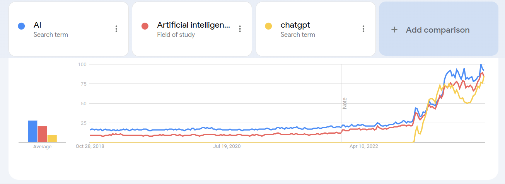
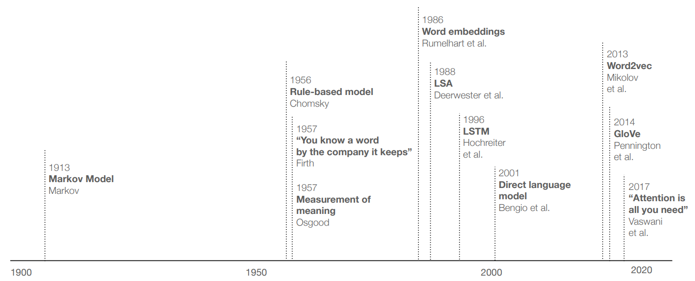
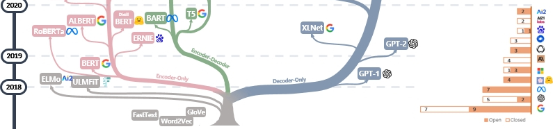
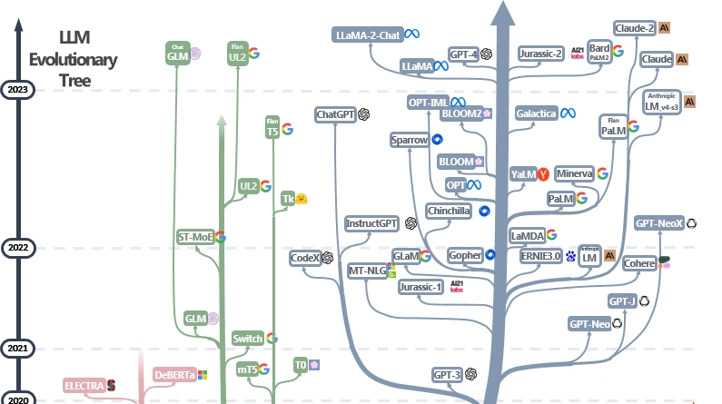

```{r xaringan-themer, include=FALSE, warning=FALSE}
#This block contains the theme configuration for the CSS lab slides style
library(xaringanthemer)
library(showtext)
style_mono_accent(
  base_color = "#5c5c5c",
  text_font_size = "1.5rem",
  header_font_google = google_font("Arial"),
  text_font_google   = google_font("Arial", "300", "300i"),
  code_font_google   = google_font("Fira Mono")
)
```

```{r setup, include=FALSE}
options(htmltools.dir.version = FALSE)
```

layout: true

<div class="my-footer"><span>David Garcia - The Social Informatics of Large Language Models</span></div> 

---

# About David Garcia

.pull-left[
.center[
```{r, echo=FALSE, out.width=270}
knitr::include_graphics("Profile.jpg")
```
]]

.pull-right[
<br>
Website: [dgarcia.eu](https://dgarcia.eu)

Twitter: [@dgarcia_eu](https://twitter.com/dgarcia_eu)

Github: [dgarcia-eu](https://github.com/dgarcia-eu)

Email: david.garcia@uni-konstanz.de
]

- Professor for Social and Behavioral Data Science, University of Konstanz
- Faculty member of the Complexity Science Hub Vienna
- Privatdozent at ETH Zurich and TU Graz

---

```{r, echo=F}
magick::image_read_pdf("indiraIntro.pdf", pages = 1)
```
---
```{r, echo=F}
magick::image_read_pdf("indiraIntro.pdf", pages = 2)
```
---

# ChatGPT takes the world by storm

.center[]

---

# Prehistory of language models

.center[]

- This course will include a brief introduction towards modern models
- Covered in detail in other courses:
  - "Document Analysis" and "Word Representations and Language Models"

---

# A Genealogy of LLMs

.center[]
[Harnessing the Power of LLMs in Practice: A Survey on ChatGPT and Beyond. Yang et al, 2023](https://arxiv.org/abs/2304.13712)

---

# A Genealogy of LLMs: the early years

.center[]

- First era: the transformers revolution
- BERT as a substantial jump in performance in various benchmarks
- Generative models (e.g. GPT-2) still very rudimentary
- Count of open and closed source models: an important issue in this course

---
# A Genealogy of LLMs: the generative era

.center[]

---

# Course objectives

After this seminar, you should be able to:

- Critically reflect on the validity, stability, and accuracy of large language models and their role in society

- Systematically use large language models as software tools integrated with their own code

- Design social and behavioral science tasks for large language models to perform and evaluate their performance and reliability

- Audit the behavior of large language models to detect inconsistencies and other issues when compared to human behavior

---

# Course topics

- **Oct 24** 	- Seminar Introduction and Motivation
- **Oct 31** 	- What does large mean?
- **Nov 07** - Natural Language Processing basics
- **Nov 14** - Advanced concepts in Natural Language Processing
- **Nov 21** - General applications of LLMs
- **Nov 28** - Content analysis with generative LLM
- **Dec 05** - Psychometrics of LLM
- **Dec 12** - Replacing survey participants with LLM
- **Dec 19**	- LLM debate and Q&A
- **Jan 09**	- Social simulacra and generative agents
- **Jan 16**	- Machine behavior: LLM as experiment participants
- **Jan 23** - Impact of LLMs in society
- **Jan 30** - Critique and ethics of LLMs
- **Feb 6** - Course summary and preliminary project presentations
---

# Grading

The course assessment will be based on:
  - a final project (60%)
  - on grades of assignments (40%)
  - bonus 10% for participation in class
  
**To be eligible for the project, students must hand in their solutions for the assignments and get a passing aggregate grade on the assignments (60/100)**

---

# Tutorials and assignments

**Tutorials: Wednesdays, 13:30-15:00 G227**
- Co-teaching by Indira Sen, David Garcia, and Mats Faulborn

The course has four assignments, with approximately five weeks per assignment. 

- First deadline (assignment 1 and 2): December 6th
- Second deadline (assignment 3 and 4): January 31st

Tutorials will build on open source models and use the OpenAI API with a setup similar to Social Media Data Analysis
  - Fixed budget per student, projects might need additional budget
  - Important:  respecting OpenAI content policies

---

# Course projects

- Course projects will be done in small groups (max 3 students)
  - Solo projects are discouraged to enable co-learning

- Seek feedback on your project ideas soon: we are available around lectures but also ask questions about your projects in the lectures

- Preliminary project presentations on **Feb 6th:** feedback from us on how to improve project plans

- (tentative) Week of March 25th - Final project presentations

- (tentative) March 31st - Project report submission deadline

- More details about report format, presentation length, etc will come later

---

# What would you like to learn about LLM?

.center[]


