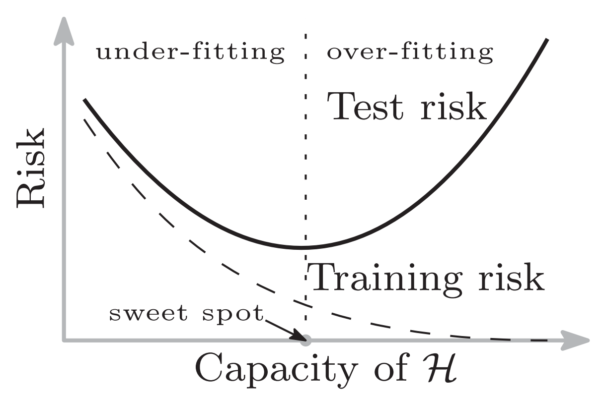

```{r xaringan-themer, include=FALSE, warning=FALSE}
#This block contains the theme configuration for the CSS lab slides style
library(xaringanthemer)
library(showtext)
style_mono_accent(
  base_color = "#5c5c5c",
  text_font_size = "1.5rem",
  header_font_google = google_font("Arial"),
  text_font_google   = google_font("Arial", "300", "300i"),
  code_font_google   = google_font("Fira Mono")
)
```

```{r setup, include=FALSE}
options(htmltools.dir.version = FALSE)
```

layout: true

<div class="my-footer"><span>David Garcia - The Social Informatics of Large Language Models</span></div> 

---

# Outline

## 1. Model size and the bias/variance tradeoff

## 2. The double descent

## 3. A small models: chaotic logistic maps

## 4. When one parameter is enough

---

# Machine Learning
.pull-left[.center[
```{r, echo=FALSE, out.width=450}
knitr::include_graphics("figs/Machin1.jpeg")
```
]]
.pull-right[
# Antonio Machin
]
---

# Machine Learning
.pull-left[.center[
```{r, echo=FALSE, out.width=450}
knitr::include_graphics("figs/Machin2.jpeg")
```
]]
.pull-right[
# Antonio Machin learning
]
---

# Machine Learning
.pull-left[.center[
```{r, echo=FALSE, out.width=450}
knitr::include_graphics("figs/Machin3.jpeg")
```
]]
.pull-right[
# Antonio Machin learning Machine Learning
]
---

### Machine learning Antonio Machin learning Machine Learning
.center[
```{r, echo=FALSE, out.width=620}

```
] https://twitter.com/TeoSeHaceHacker
---

# Machine learning problems

Training examples:

$$(x_1, y_1), ... , (x_n, y_n) \in \mathbb R^d \times \mathbb R$$
In the previous example:
- $x_i$ is a vector of features of the image
- $y_i$ is a class: it contains *Machin learning Machine Learning* (1) or not (0)

$y_i$ can also be a number (regression) or a class from a larger set

Training data is assumed to be representative (e.g. taken at random) from a larger distrbution of interest (where we want to apply the classifier)

---

# Training and test risk

A machine learning model is a predictor for unseen data
$$ h_n: \mathbb R^d \rightarrow \mathbb R $$


.pull-left[
Fitting: minimize training risk (error) based on loss function $l$
$$ \frac{1}{n} \sum_{i=1}^n l(h(x_i),y_i) $$
]

.pull-right[
Common loss functions: 
- regression: $l(y',y) = (y'-y)^2$
- classification: $l(y',y)  = \mathbb 1 _{y' \neq y}$]

Machine Learning aims to minimize **test risk**: same mean loss over an unseen test dataset from the same population as the training dataset
---

# Capacity and model size

The predictor function $h_n$ belongs to a larger function class $\mathcal H$ where all possible fits we can do exist.

The **capacity** of $\mathcal H$ measures how large $\mathcal H$ is

  - The capacity is often approximated as the **number of parameters** of $h_n$

  - *small* models come from low-capacity $\mathcal H$, i.e. have few parameters

  - *large* models come from high-capacity $\mathcal H$, i.e. have many parameters

[Reconciling modern machine-learning practice and the classical bias–variance trade-off. Mikhail Belkin, Daniel Hsu, Siyuan Ma, and Soumik Mandal. PNAS (2019)](https://www.pnas.org/doi/10.1073/pnas.1903070116)

---

# Overfitting and Underfitting
.center[]
https://www.mathworks.com/discovery/overfitting.html

---

# Bias-Variance tradeoff
.center[]
Bias: underfitting (min. training risk), Variance: overfitting (min. test risk)
---

# Overparametrization

## 1. Model size and the bias/variance tradeoff

## *2. The double descent*

## 3. A small models: chaotic logistic maps

## 4. When one parameter is enough

---
# The double descent

For some problems and models (e.g. deep neural networks), test risk might decrease for extremely models. Training risk becomes zero after capacity=n.

---

# Occam's razor?

.center[*"The simplest explanation is usually the best one."*]

What if a simple model is not necessarily the one with the fewer parameters?

$l_2$ norm, also known as Eucledian norm:
$$l_2 = \sum_j^P x_j^2$$
- A model with more parameters could generalize better if their $l_2$ norm is smaller than models with less parameters

- Does the $l_2$ norm also decrease in the second descent?

---

# MNIST as a study in double descent

.center[]

MNIST is a database of handwritten digits. A machine learning task is to classify the image of the hand-written characters to their corresponding letters/digits

---

# MNIST double descent with NN and RF

.pull-left[

]

.pull-right[

]

---
# MNIST double descent with RFF model

.center[]

---
# Norm in RFF for MNIST
.center[]

---

.center[]

---

# Some caveats

- **Beware of overselling of large models**

- The double descent exists in some problems but it is far from true that it exists in all problems

- Overparametrization requires evidence
  - Careful construction and handling of test samples
  - Out-Of-Domain (OOD) tests
  - If possible: analysis of performance as a function of model size

---

# The Von Neumann Challenge

*"With four parameters I can fit an elephant, and with five I can make him wiggle his trunk"* .right[Attributed to John Von Neumann by Enrico Fermi]
.center[]
[Drawing an elephant with four complex parameters . Jürgen Mayer; Khaled Khairy; Jonathon Howard. American Journal of Physics (2010)](https://pubs.aip.org/aapt/ajp/article-abstract/78/6/648/1042069/Drawing-an-elephant-with-four-complex-parameters?redirectedFrom=fulltext)

---

# Logistic Maps and Chaos

## 1. Model size and the bias/variance tradeoff

## 2. The double descent

## *3. A small models: chaotic logistic maps*

## 4. When one parameter is enough

---

# Logistic maps

Iterative function of one-dimensional values that are calculated based on only the previous value. For example:

$$x_{n+1}=\lambda x_{n}(1-x_{n})\quad\text{with}\quad n=0,1,2,3…$$
Behavior depends on $\lambda$ and the initial condition $x_0$,

For example, for $\lambda=0.920$ and $x_0=0.023$

$x_{0...}=$ 
0.023, 0.021, 0.019, 0.017, 0.015, 0.014, 0.012, 0.011, 0.010, 0.009, 0.009, 0.008, 0.007, 0.006, 0.006, 0.005, 0.005,...

https://www.complexity-explorables.org/flongs/logistic/

---

# Iterating over a map

.center[]

---

# Iterating over a map

.center[]

---

# Iterating over a map: periodic example

.center[]

---

# Iterating over a map: aperiodic example

.center[]

---
# Chaos: sensitivity to initial conditions

.center[ ]

---
# Chaotic time series
.center[]
.center[https://www.complexity-explorables.org/flongs/logistic/]

---


# When one parameter is enough

## 1. Model size and the bias/variance tradeoff

## 2. The double descent

## 3. A small models: chaotic logistic maps

## *4. When one parameter is enough*

---

# Logistic maps as models of scatter plots
.center[]

[One Parameter is Always Enough. Steven Piantadosi. AIP advances (2018)](https://pubs.aip.org/aip/adv/article/8/9/095118/22887/One-parameter-is-always-enough)

---

#Fitting any scatter plot

.center[]
For every scatter plot to fit, there is an initial value ( $\theta$ ) of the chaotic iterative map that generates it

---

# Reflecting on one paremeter is enough

- If we can fit anything with just one parameter, what is the catch?

--

- If we fit a training dataset of a classification with this method, how good do you think will be the model in a test dataset?

--

- In LLMs used as chatbots, where could we have an infinite-precision parameter $\theta$?

--

- How do we avoid overfitting on $\theta$ when using a LLM?

--

- What have we learned today about model sizes?


