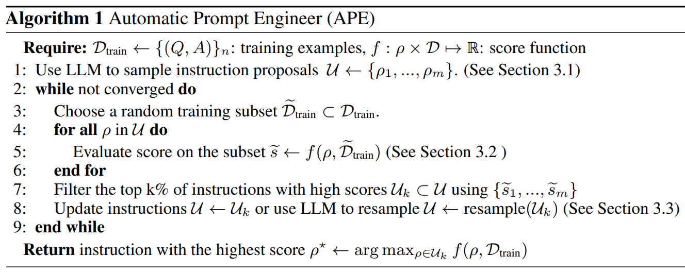

```{r xaringan-themer, include=FALSE, warning=FALSE}
#This block contains the theme configuration for the CSS lab slides style
library(xaringanthemer)
library(showtext)
style_mono_accent(
  base_color = "#5c5c5c",
  text_font_size = "1.5rem",
  header_font_google = google_font("Arial"),
  text_font_google   = google_font("Arial", "300", "300i"),
  code_font_google   = google_font("Fira Mono")
)
```

```{r setup, include=FALSE}
options(htmltools.dir.version = FALSE)
```

layout: true

<div class="my-footer"><span>David Garcia - The Social Informatics of Large Language Models</span></div> 

---

# What is Prompt Engineering?

**Prompt Engineering: designing prompts as natural language text input that describes the task that an AI model should perform.**
.pull-left[
.center[
```{r, echo=FALSE, out.width=420}

```
</br>
Prompt Engineering by DALL-E]
]


- Prompt design is optimized with respect to a measurable target, for example precision in text labelling or diversity of output images
- It requires a minimal ability to use natural language, but it is not an art
- Engineering means that design has to be quantitatively and generalizable
- As Aerospace Engineering uses some knowledge of math and physics, Prompt Engineering should use some knowledge of linguistics and psychology

---

# Chain-of-Thought prompting
.center[
</br>
[Large Language Models are Zero-Shot Reasoners. Kojima et al (2023)](https://arxiv.org/abs/2205.11916)
]

---

# Automatic Prompt Engineering (APE)

.center[
</br>
[Large Language Models Are Human-Level Prompt Engineers. Zhou et al (2023)](https://arxiv.org/abs/2205.11916)
]

---

# Prompt Massaging: EmotionPrompt

.center[
</br>
[Large Language Models Understand and Can Be Enhanced by
Emotional Stimuli. Li et al (2023)](https://arxiv.org/abs/2307.11760)
]
---

.center[
</br>
[Large Language Models Understand and Can Be Enhanced by
Emotional Stimuli. Li et al (2023)](https://arxiv.org/abs/2307.11760)
]
---

.center[
</br>
[Large Language Models Understand and Can Be Enhanced by
Emotional Stimuli. Li et al (2023)](https://arxiv.org/abs/2307.11760)
]
---

.center[
</br>
]

"We notice that the results have high variance. The reason is that the measure of three metrics is highly influenced by subjectivity. Different people may have different opinions on an answer. "</br>
[Large Language Models Understand and Can Be Enhanced by
Emotional Stimuli. Li et al (2023)](https://arxiv.org/abs/2307.11760)
---
# Diagnosing biases in Claude
.center[]
[Evaluating and Mitigating Discrimination in Language Model Decisions. Tamkin et al (2023)](https://arxiv.org/abs/2312.03689)
---

# Diagnosing biases in Claude
.center[]
[Evaluating and Mitigating Discrimination in Language Model Decisions. Tamkin et al (2023)](https://arxiv.org/abs/2312.03689)
---

# When rephrasing doesn't work
.center[]
[Evaluating and Mitigating Discrimination in Language Model Decisions. Tamkin et al (2023)](https://arxiv.org/abs/2312.03689)
---

# Prompt Engineering to remove bias
.pull-left[]
.pull-right[]
</br>
</br>
[Evaluating and Mitigating Discrimination in Language Model Decisions. Tamkin et al (2023)](https://arxiv.org/abs/2312.03689)

---

# Prompt Engineering to remove bias
.center[]
[Evaluating and Mitigating Discrimination in Language Model Decisions. Tamkin et al (2023)](https://arxiv.org/abs/2312.03689)
---

## The latest discussions: everything works?
.center[]
[Principled Instructions Are All You Need for Questioning LLaMA-1/2, GPT-3.5/4. 
Bsharat, Myrzakhan, & Shen (2023)](https://arxiv.org/abs/2312.16171v1)


---

# Questions about Prompt Engineering

- What do we need to evaluate a prompt design or redesign?

- How can  we isolate a design effect from other effects (length, politeness)?

- What do we need to consider when we use human input as a post-hoc evaluation?

- How to ensure that APE does not overfit a prompt?

- How can we generalize what we learn from a prompt engineering exercise?

- What skills do you need to become a prompt engineer?


